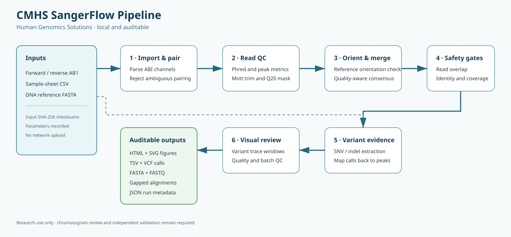
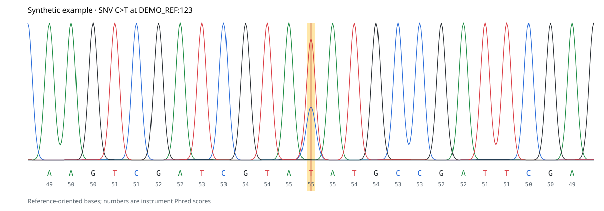
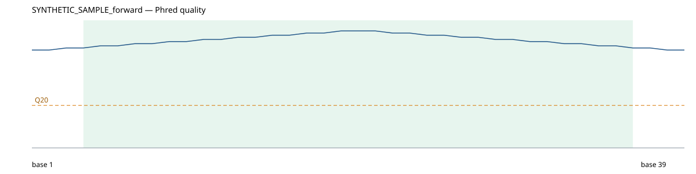
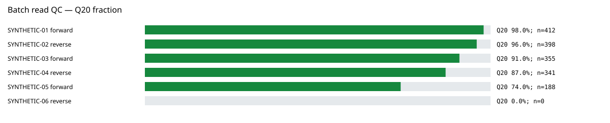

# CMHS SangerFlow Pipeline

**Human Genomics Solutions**

CMHS SangerFlow Pipeline is a local, auditable workflow for Sanger `.ab1` chromatograms. It
performs trace-level QC, Mott quality trimming, forward/reverse consensus generation, alignment
to a DNA reference, conservative small-variant extraction, and reproducible reporting without
calling external bioinformatics executables.

> **Research-use software.** CMHS SangerFlow Pipeline is not a medical device and has not been
> clinically validated. Inspect chromatograms and confirm calls independently before clinical use.

## Why CMHS SangerFlow Pipeline?

- Parses ABI base calls, Phred qualities, peak locations, and four-color trace channels.
- Refuses ambiguous automatic pairing instead of guessing which reads belong together.
- Keeps reverse-read qualities synchronized when reverse-complementing.
- Resolves paired-read disagreements using quality evidence or an IUPAC ambiguity code.
- Verifies read orientation against the selected reference and records any correction.
- Rejects pairs with insufficient overlap and samples with poor reference identity.
- Maps each call back to forward/reverse Phred and secondary-peak evidence.
- Treats reference flanks outside the sequenced interval as noncoverage, not deletions.
- Records parameters, software versions, input paths, and SHA-256 checksums for every run.
- Produces TSV, VCF, FASTA/FASTQ, gapped alignments, chromatogram SVGs, and an HTML report.

## Workflow



## Example outputs

The figures below use deterministic synthetic data and contain no patient or laboratory sequence.

### Variant-centred chromatogram evidence



### Per-read Phred quality profile



### Batch Q20 dashboard



Regenerate these examples after changing figure code with:

```bash
python scripts/generate_readme_figures.py
```

## Installation

### Standalone download — recommended

For the quickest setup, download the archive matching your computer from the
[latest GitHub release](https://github.com/mushalallam/cmhs-sangerflow/releases/latest):

| Computer | Release file |
| --- | --- |
| Apple Silicon Mac (M1/M2/M3/M4/M5) | `macOS-Apple-Silicon.zip` |
| Intel Mac | `macOS-Intel.zip` |
| 64-bit Windows | `Windows-x86_64.zip` |
| 64-bit Linux | `Linux-x86_64.tar.gz` |

Extract the download and verify it immediately:

```bash
# macOS or Linux
./sangerflow doctor
```

```powershell
# Windows PowerShell
.\sangerflow.exe doctor
```

No Python, Conda, compiler, administrator access, or internet connection is required after the
download. Each archive includes a quick-start guide and has a matching SHA-256 checksum file.
The executables are built and tested natively on GitHub Actions. They are not yet code-signed,
so macOS Gatekeeper or Windows SmartScreen may ask for confirmation on first launch; verify the
checksum and follow the included platform instructions.

### Conda or Python installation

This remains useful for developers and users who prefer managed environments. Python 3.10 or
newer is required:

```bash
conda create -n sangerflow python=3.12 pip
conda activate sangerflow
python -m pip install .
```

For development:

```bash
python -m pip install -e '.[dev]'
ruff check .
pytest
```

## Quick start

The safest input method is a CSV sample sheet:

```csv
sample,forward,reverse
patient-01,patient-01_F.ab1,patient-01_R.ab1
```

Paths are resolved relative to `--input`:

```bash
sangerflow run \
  --input /path/to/chromatograms \
  --sample-sheet /path/to/samples.csv \
  --reference /path/to/reference.fasta \
  --output /path/to/new-results
```

Automatic pairing is available for unambiguous names such as `sample_F_01.ab1` and
`sample_R_01.ab1`:

```bash
sangerflow run \
  --input /path/to/chromatograms \
  --reference /path/to/reference.fasta \
  --output /path/to/new-results
```

An output directory must be new or empty. The pipeline never overwrites a populated analysis
directory.

Inspect a trace without running the pipeline:

```bash
sangerflow inspect sample_F.ab1
```

Check an installation and collect troubleshooting information with:

```bash
sangerflow doctor
```

Use `--allow-single` for samples that genuinely have only one sequencing direction.

## Outputs

```text
results/
├── reads/                 trimmed reads and qualities in FASTQ
├── consensus/             per-sample and aggregate consensus FASTA
├── alignments/            read/read and consensus/reference gapped FASTA
├── traces/                full traces, quality profiles, variant windows, and batch QC SVG
└── reports/
    ├── report.html        human-readable report linked to local trace SVGs
    ├── read_qc.tsv        per-read quality metrics
    ├── peak_evidence.tsv  per-base primary/secondary trace evidence
    ├── samples.tsv        per-sample outcome and failure reason
    ├── variants.tsv       complete call table
    ├── variants.vcf       coordinate-sorted VCF 4.3 calls
    └── run_metadata.json  parameters, versions, and SHA-256 manifest
```

Failed samples are retained in reports with an explicit reason. If any sample fails, the CLI
returns a nonzero exit status while preserving successful sample outputs.

For each called variant, the report includes reference-oriented chromatogram windows and records
available forward/reverse Phred scores, secondary-peak ratios, and strand support. Indel strand
support is marked `not_assessed` in version 0.2 rather than inferred without deconvolution.

Paired samples must have at least 30 overlapping bases at 80% identity, and the final consensus
must align to the requested reference at 80% identity while covering at least 80% of the
consensus. These safety gates can be changed with `--min-overlap`, `--min-overlap-identity`,
`--min-reference-identity`, and `--min-reference-coverage`; changes are captured in run
metadata.

## Quality and mixed peaks

Default behavior uses instrument base calls and masks trimmed bases below Q20 as `N`. Raw
secondary-peak ratios are always reported when the ABI channels are available.

Experimental IUPAC calling can be enabled explicitly:

```bash
sangerflow run ... --call-mixed-peaks --mixed-peak-ratio 0.33
```

Secondary peaks can arise from true heterozygosity, contamination, dye artifacts, or poor
sequence quality. Enabling this option does not replace manual chromatogram review.

## Algorithm and limitations

See [docs/algorithm.md](docs/algorithm.md) for the method, assumptions, variant representation,
and known limitations. The [development roadmap](docs/roadmap.md) identifies features that need
additional biological validation. Use `sangerflow run --help` for every threshold and option.

For users migrating from the older ASAP workflow, see
[docs/legacy-comparison.md](docs/legacy-comparison.md). CMHS SangerFlow Pipeline is an independent
implementation, not a drop-in replacement; the optional ASAP exon/translation mode is not part
of version 0.2.

## Data safety

The repository ignores `.ab1`, `.abi`, and generated result directories. Never commit patient
identifiers or chromatograms to a public repository. The pipeline runs locally and does not send
sequence data over the network.

## License

MIT License. See [LICENSE](LICENSE).
